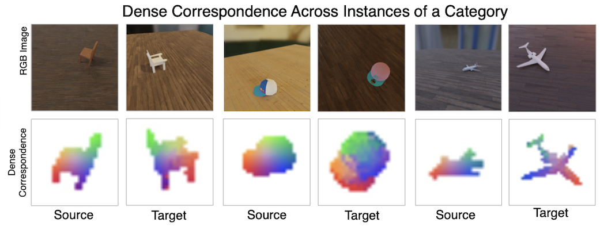

# DOPE: Deep Object Patch Encodings - NeurIPS 2022




This is a repository containing PyTorch code for [Learning Dense Object Descriptors from Multiple
Views for Low-shot Category Generalization](https://openreview.net/pdf?id=KJemAi9fymT).

If you use our work in your research, please cite
```bibtex
@inproceedings{stojanov2022learning,
  title={Learning Dense Object Descriptors from Multiple Views for Low-shot Category Generalization},
  author={Stojanov, Stefan and Thai, Ngoc Anh and Huang, Zixuan and Rehg, James Matthew},
  booktitle={Advances in Neural Information Processing Systems}
}
```
## Installation

For this project we use [miniconda](https://docs.conda.io/en/latest/miniconda.html) to manage dependencies. After setting it up, you can install the `dope_selfsup` environment

```bash
conda env create -f environment.yml
conda activate dope_selfsup

pip install -e .
```
## Datasets
To download the datasets and create the appropriate directory structure and extract the data splits use the following command. The ABC tarball is about 60GB and the ModelNet is about 5GB.
```
bash download_data.sh
```
To test whether the data setup is correct run, which will output some sample training data under `./dataset_test_outputs`
```
python dope_selfsup/data/contrastive/ABC_local.py
python dope_selfsup/data/contrastive/modelnet_local.py
```
## Training
To train the model run the following script, which will train and validate with val/test `split_000`. Training requires using distributed dataparallel. The training code will generate heatmap visualizations and segmentation prediction visualizations as training progresses.
```
bash scripts/train_ddp.sh
```

## Evaluation
To perform validation on each split run the following
```
python dope_selfsup/inference/validation.py --enc_p=<path to ckpt_dir in trained model directory> --n_shot=1 --n_way=5 --split_dir=<split_000, split_001, etc>
```
This will output the validation accuracy for each saved checkpoint. To test the best models run the following
```
python dope_selfsup/inference/testing.py --enc_p=<path to ckpt_dir in trained model directory> --split_dir=<split_000, split_001, etc>
```

## Code Credits
We are grateful for the authors of the following code repositories, from where we borrow components used in this repository
* [RFS](https://github.com/WangYueFt/rfs/)
* [SimpleShot](https://github.com/mileyan/simple_shot)
* [MoCo-official](https://github.com/facebookresearch/moco)
* [CMC](https://github.com/HobbitLong/CMC)
* [Dense Object Nets](https://github.com/RobotLocomotion/pytorch-dense-correspondence)
* [Contrast Landmark](https://github.com/cvl-umass/contrast-landmark)

